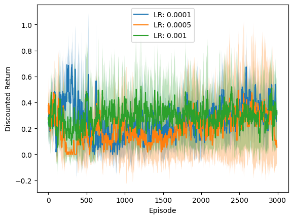
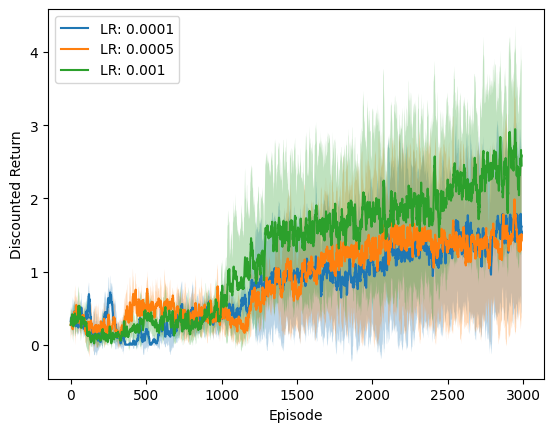
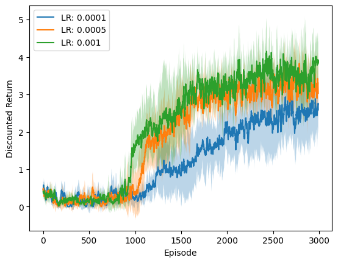
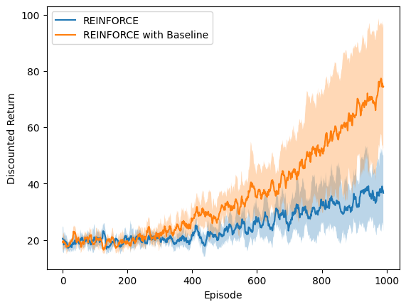
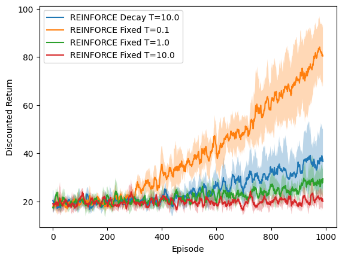
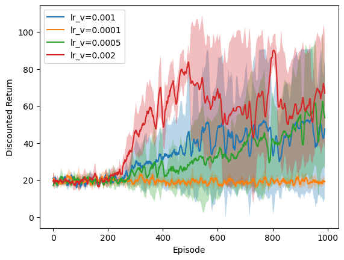

# Deep RL Control: DQN and Policy Gradient Methods

Value-based and policy-based deep RL implemented from scratch in PyTorch. DQN variants (sequential, uniform replay, prioritized replay) on [MinAtar Breakout](https://github.com/kenjyoung/MinAtar), and policy gradient methods (REINFORCE, REINFORCE with baseline, one-step Actor-Critic) on [CartPole-v1](https://gymnasium.farama.org/environments/classic_control/cart_pole/). Includes ablations on replay strategy, Boltzmann temperature, and critic learning rate.

## Key Results

All curves average 5 seeds with shaded $\pm 1$ std. Full implementation in [`dqn.ipynb`](dqn.ipynb).

### Experience Replay

DQN on [MinAtar Breakout-v1](https://github.com/kenjyoung/MinAtar/blob/master/minatar/environments/breakout.py) (10x10x4 observations, 3 actions) across 3000 episodes with three replay strategies:

| Sequential (no buffer) | Uniform Replay | Prioritized Replay |
|:-:|:-:|:-:|
|  |  |  |

Without a replay buffer, each transition is used once and thrown away, and the sequential samples are strongly correlated (not i.i.d.). The agent never learns. Uniform replay breaks this correlation and lets the agent reuse data: transitions from the occasional good episode (where the ball hits bricks) get sampled multiple times instead of once.

Prioritized replay performs even better. The update rule uses one-step TD error, which bootstraps. When the agent bounces the ball off the paddle and hits bricks, the resulting non-zero reward creates high TD-error at those transitions, and credit assignment to the preceding states and actions that led to that outcome takes time to propagate. Prioritized sampling replays these high-error transitions more frequently, accelerating the propagation of useful learning signal. At the same time, it corrects the resulting sampling bias with importance sampling weights.

### Baselines Reduce Variance



REINFORCE with a learned state-value baseline achieves roughly double the average discounted return of vanilla REINFORCE after 1000 episodes. Subtracting $\hat{v}(S_t, w)$ from the return $G_t$ reduces the variance of the policy gradient estimator without introducing bias, making each update to the policy parameters more effective. The wider spread across runs reflects the baseline network's own learning dynamics.

### Temperature: The Floor Matters More Than the Schedule



Comparing Boltzmann temperature schedules for REINFORCE: exponential decay from $T=10$ with a floor of $T_{\min}=0.5$, and fixed temperatures $T \in \{0.1, 1.0, 10.0\}$.

Fixed $T{=}0.1$ outperforms the decay schedule. The annealing variant's temperature never drops below 0.5, so even after the policy network has learned good action preferences, the agent keeps taking suboptimal actions too often. Fixed $T{=}10$ never improves because it's always exploring uniformly. Fixed $T{=}1.0$ improves slowly. Meanwhile, $T{=}0.1$ is nearly greedy but has enough stochasticity to find a good policy and then exploit it effectively.

### Critic Must Learn Faster Than Actor



In one-step Actor-Critic, the actor's policy gradient is proportional to the one-step TD error, which serves as an advantage estimate and depends entirely on the critic's value function.

If the critic learns at the same rate as the actor ($\alpha_V = \alpha_\pi = 10^{-4}$), the critic produces inaccurate advantages, and the actor makes large updates based on bad signal. This seems to prevent convergence entirely. Setting $\alpha_V$ too high ($2 \times 10^{-3}$) can also hurt because the critic overshoots and produces unstable value estimates. Best results at $\alpha_V = 10^{-3}$ with $\alpha_\pi = 10^{-4}$: the critic learns fast enough to provide accurate advantages without becoming unstable.

## Methods

| Algorithm | Environment | Type |
|---|---|---|
| DQN (Sequential) | MinAtar Breakout | Value-based, online TD |
| DQN + Uniform Replay | MinAtar Breakout | Value-based, 50K replay buffer |
| DQN + Prioritized Replay | MinAtar Breakout | Value-based, TD-error priorities ($\alpha{=}0.6$, $\beta: 0.4 {\to} 1.0$) |
| REINFORCE | CartPole-v1 | Policy gradient, Monte Carlo returns |
| REINFORCE + Baseline | CartPole-v1 | Policy gradient, learned $\hat{v}(s)$ baseline |
| One-step Actor-Critic | CartPole-v1 | Actor-Critic, TD(0) advantage |

All networks are 2-layer MLPs (128 units, ReLU). Policies use Boltzmann softmax. Target networks updated every 1000 steps via hard copy. Full hyperparameters in the notebook.

## Implementation Notes

All DQN variants use a target network updated via hard parameter copy every 1000 environment steps. The Bellman target $r + \gamma \max_{a'} Q(s', a'; \theta^-)$ is computed under `torch.no_grad()` so gradients only flow through the prediction term. [`scripts/explore_graph.py`](scripts/explore_graph.py) is a short script I wrote to verify this: it traces PyTorch's computational graph from two forward passes through the same network and confirms that without `no_grad`, both graphs share the same leaf parameters and gradients accumulate on them from both sides of the loss.

## Setup

```bash
# Python 3.12+, uv package manager
uv sync
uv run jupyter lab
```

## References

**Papers**
- Mnih et al., [Human-level control through deep reinforcement learning](https://www.nature.com/articles/nature14236), *Nature*, 2015
- Schaul et al., [Prioritized Experience Replay](https://arxiv.org/abs/1511.05952), *ICLR*, 2016
- Williams, [Simple statistical gradient-following algorithms for connectionist reinforcement learning](https://link.springer.com/article/10.1007/BF00992696), *Machine Learning*, 1992
- Sutton & Barto, [Reinforcement Learning: An Introduction](http://incompleteideas.net/book/the-book-2nd.html), 2nd ed., 2018

**Resources**
- [MinAtar](https://github.com/kenjyoung/MinAtar) — Atari-inspired testbed for RL experiments
- [MinAtar Breakout source](https://github.com/kenjyoung/MinAtar/blob/master/minatar/environments/breakout.py)
- [ALE Breakout](https://ale.farama.org/environments/breakout/) — full Atari environment reference
- [Gymnasium CartPole-v1](https://gymnasium.farama.org/environments/classic_control/cart_pole/)
- [PyTorch DQN tutorial](https://docs.pytorch.org/tutorials/intermediate/reinforcement_q_learning.html)

## License

MIT
